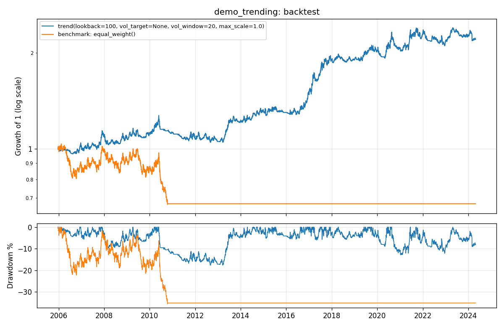

# Backtest: demo_trending

Strategy `trend(lookback=100, vol_target=None, vol_window=20, max_scale=1.0)` vs benchmark `equal_weight()`, 2005-12-21 to 2024-04-26 (4,787 trading days).
Data source: `synthetic` · symbols: AAA, BBB, CCC, DDD, EEE · costs: 1 bps commission + 5 bps slippage.



| Metric | Strategy | Benchmark |
|---|---|---|
| Total return | 120.2% | -32.8% |
| CAGR | 4.2% | -2.1% |
| Volatility | 8.7% | 7.7% |
| Sharpe | 0.52 | -0.23 |
| Sortino | 0.76 | -0.33 |
| Max drawdown | -17.6% | -35.4% |
| Longest drawdown (days) | 1,014 | 4,749 |
| Avg gross exposure | 45.7% | 25.7% |
| Turnover (x equity / yr) | 10.29 | 0.23 |
| Fills | 2,184 | 169 |
| Costs paid (% of start) | 17.7% | 0.2% |
| Orders rejected by risk | 0 | 0 |
| Kill switch | never tripped | tripped |

## Should we believe it?

- Probabilistic Sharpe ratio (P[true Sharpe > 0]): **0.99** (want at least 0.95).
- 95% bootstrap interval for the Sharpe ratio: [0.11, 0.92].
- Timing test: gross Sharpe 0.70 vs randomly time-shifted copies (95th percentile 0.07), p = 0.01.
- This is a single backtest with no multiple-testing correction. Use `research` to sweep parameters honestly.

## Risk layer

- Strategy kill switch: never tripped.
- Benchmark kill switch: drawdown 35.43% breached the 35% limit.
- Orders rejected: 0.

## Data cleaning

```
No data issues found.
```
