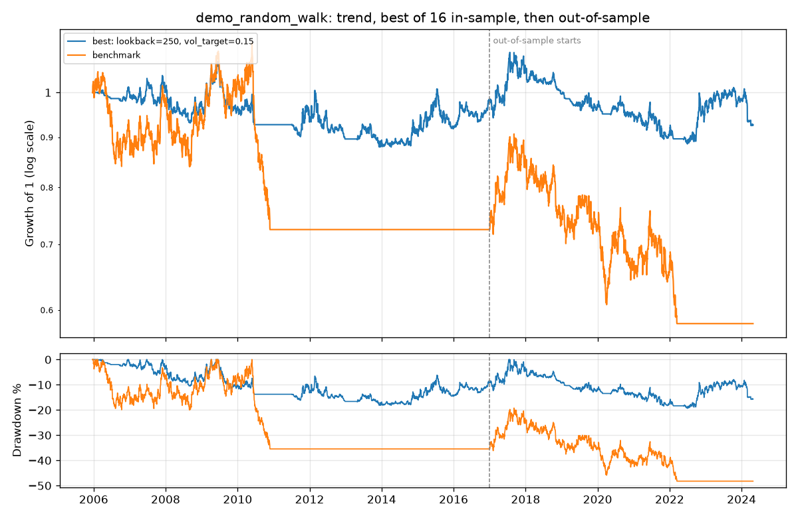

# Research: demo_random_walk

Strategy `trend`. In-sample 2005-12-21 to 2016-12-30; out-of-sample 2017-01-02 to 2024-04-26.

Trial ledger: 16 distinct parameter set(s) tried on this strategy and data so far; earlier runs had evaluated an overlapping out-of-sample period 0 time(s). This run is `20261004-173242-d0668b`.



## Verdict

- Best of 16 in-sample trial(s): Sharpe -0.00, probabilistic Sharpe 0.50.
- FAIL  Deflated for 16 trials, the in-sample result is consistent with luck (DSR 0.19, want >= 0.95).
- FAIL  Out-of-sample Sharpe -0.06; 95% interval [-0.71, 0.52] includes zero.
- FAIL  Did not beat the benchmark out-of-sample: Sharpe difference +0.09, one-sided 95% lower bound -0.37 (want > 0; benchmark Sharpe -0.15).
- FAIL  Timing does not beat randomly time-shifted copies of itself (p = 0.61).
- Passed 0 of 4 checks. Treat the in-sample numbers as an upper bound, not an estimate.

## In-sample vs out-of-sample

| Metric | Best, in-sample | Best, out-of-sample | Benchmark, out-of-sample |
|---|---|---|---|
| Total return | -2.4% | -5.1% | -19.8% |
| CAGR | -0.2% | -0.7% | -2.9% |
| Volatility | 6.5% | 7.1% | 13.4% |
| Sharpe | -0.00 | -0.06 | -0.15 |
| Sortino | -0.00 | -0.08 | -0.21 |
| Max drawdown | -18.2% | -19.3% | -35.9% |
| Longest drawdown (days) | 1,966 | 1,763 | 1,733 |
| Avg gross exposure | 33.2% | 35.5% | 69.5% |
| Turnover (x equity / yr) | 6.37 | 8.28 | 0.41 |
| Fills | 1,687 | 1,409 | 129 |
| Costs paid (% of start) | 4.1% | 3.8% | 0.2% |
| Orders rejected by risk | 0 | 0 | 0 |
| Kill switch | never tripped | never tripped | tripped |

## All 16 in-sample trials

| Params | Sharpe | Total return | Max drawdown | Kill switch |
|---|---|---|---|---|
| lookback=250, vol_target=0.15 | -0.00 | -2.4% | -18.2% |  |
| lookback=250, vol_target=None | -0.03 | -6.5% | -23.8% |  |
| lookback=200, vol_target=0.15 | -0.07 | -7.3% | -16.6% |  |
| lookback=200, vol_target=None | -0.13 | -14.4% | -22.8% |  |
| lookback=150, vol_target=0.15 | -0.22 | -17.7% | -20.4% |  |
| lookback=60, vol_target=0.15 | -0.25 | -20.0% | -23.9% |  |
| lookback=150, vol_target=None | -0.28 | -26.4% | -29.2% |  |
| lookback=10, vol_target=0.15 | -0.30 | -24.3% | -32.5% |  |
| lookback=100, vol_target=0.15 | -0.30 | -23.1% | -26.1% |  |
| lookback=60, vol_target=None | -0.32 | -30.1% | -34.0% |  |
| lookback=20, vol_target=0.15 | -0.33 | -25.6% | -29.4% |  |
| lookback=40, vol_target=0.15 | -0.34 | -26.0% | -30.0% |  |
| lookback=100, vol_target=None | -0.41 | -35.1% | -35.2% | tripped |
| lookback=10, vol_target=None | -0.41 | -34.2% | -35.1% | tripped |
| lookback=40, vol_target=None | -0.44 | -33.2% | -35.1% | tripped |
| lookback=20, vol_target=None | -0.45 | -34.4% | -35.2% | tripped |

## Data cleaning

```
No data issues found.
```
