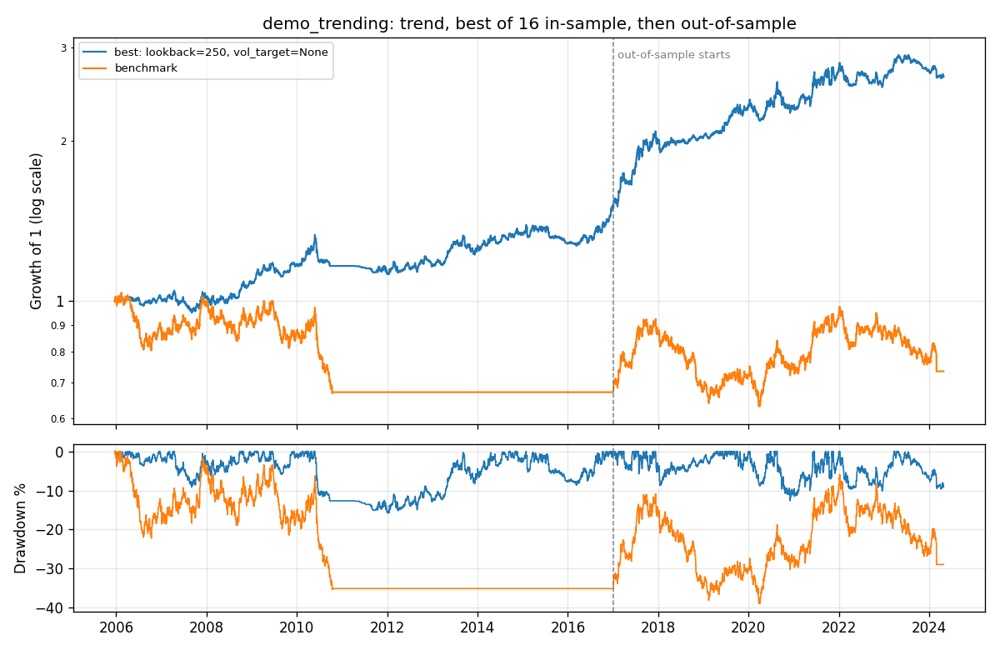

# Research: demo_trending

Strategy `trend`. In-sample 2005-12-21 to 2016-12-30; out-of-sample 2017-01-02 to 2024-04-26.



## Verdict

- Best of 16 in-sample trial(s): Sharpe 0.54, probabilistic Sharpe 0.97.
- FAIL  Deflated for 16 trials, the in-sample result is consistent with luck (DSR 0.55, want >= 0.95).
- PASS  Out-of-sample Sharpe 0.77; 95% interval [0.12, 1.38] excludes zero.
- PASS  Beat the benchmark's out-of-sample Sharpe (0.15).
- FAIL  Timing does not beat randomly time-shifted copies of itself (p = 0.08).
- Passed 2 of 4 checks. Treat the in-sample numbers as an upper bound, not an estimate.

## In-sample vs out-of-sample

| Metric | Best, in-sample | Best, out-of-sample | Benchmark, out-of-sample |
|---|---|---|---|
| Total return | 49.0% | 77.5% | 9.5% |
| CAGR | 3.6% | 7.9% | 1.2% |
| Volatility | 6.9% | 10.6% | 15.4% |
| Sharpe | 0.54 | 0.77 | 0.15 |
| Sortino | 0.78 | 1.11 | 0.22 |
| Max drawdown | -15.8% | -12.7% | -31.6% |
| Longest drawdown (days) | 1,119 | 351 | 981 |
| Avg gross exposure | 38.5% | 55.2% | 95.5% |
| Turnover (x equity / yr) | 4.69 | 4.38 | 0.56 |
| Fills | 629 | 442 | 248 |
| Costs paid (% of start) | 3.8% | 3.1% | 0.3% |
| Orders rejected by risk | 0 | 0 | 0 |
| Kill switch | never tripped | never tripped | tripped |

## All 16 in-sample trials

| Params | Sharpe | Total return | Max drawdown | Kill switch |
|---|---|---|---|---|
| lookback=250, vol_target=None | 0.54 | 49.0% | -15.8% |  |
| lookback=250, vol_target=0.15 | 0.53 | 37.8% | -10.3% |  |
| lookback=200, vol_target=None | 0.53 | 50.4% | -14.4% |  |
| lookback=200, vol_target=0.15 | 0.53 | 38.8% | -9.6% |  |
| lookback=100, vol_target=0.15 | 0.50 | 39.8% | -12.3% |  |
| lookback=100, vol_target=None | 0.49 | 48.8% | -17.6% |  |
| lookback=150, vol_target=None | 0.41 | 37.2% | -16.4% |  |
| lookback=150, vol_target=0.15 | 0.41 | 29.3% | -11.7% |  |
| lookback=60, vol_target=0.15 | 0.31 | 22.1% | -12.7% |  |
| lookback=60, vol_target=None | 0.28 | 24.3% | -17.5% |  |
| lookback=40, vol_target=0.15 | 0.03 | 0.0% | -20.1% |  |
| lookback=40, vol_target=None | -0.02 | -5.8% | -26.9% |  |
| lookback=20, vol_target=0.15 | -0.04 | -6.0% | -18.7% |  |
| lookback=20, vol_target=None | -0.12 | -14.5% | -27.4% |  |
| lookback=10, vol_target=0.15 | -0.15 | -13.4% | -25.3% |  |
| lookback=10, vol_target=None | -0.19 | -20.6% | -33.4% |  |

## Data cleaning

```
No data issues found.
```
